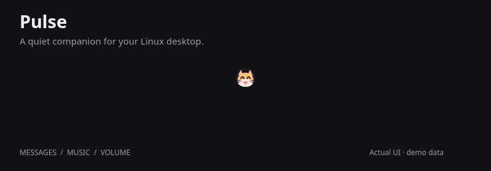
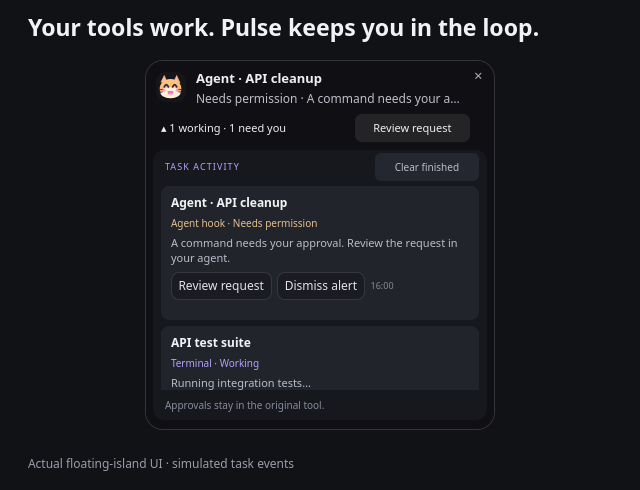
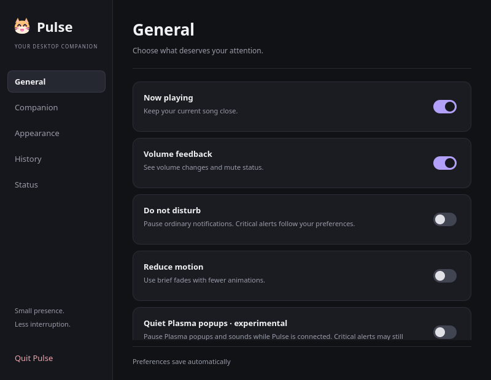
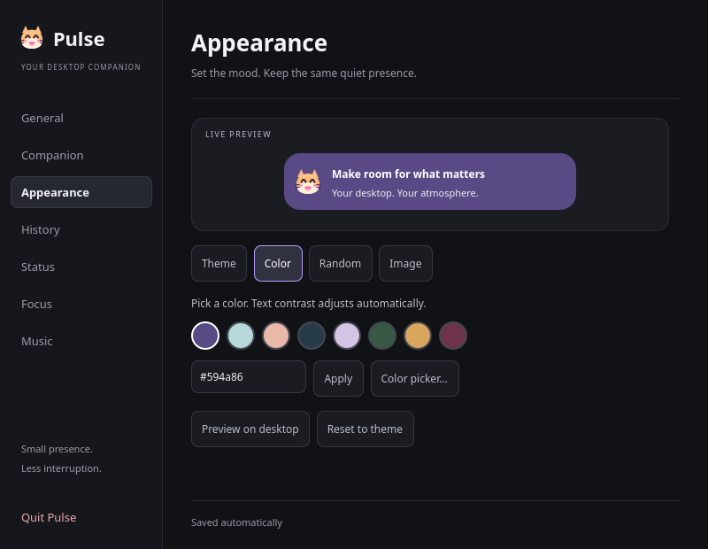

<div align="center">
  
  <h1>Pulse</h1>
  <p>A floating companion for your desktop.</p>
  <p>Notifications, AI agent updates, and running jobs in a floating island.</p>
</div>



**Early preview · Linux remains the primary tested platform; a Windows task-island preview is now included.** Live notification capture has been confirmed on KDE; wider desktop compatibility and native Wayland behavior still need testing.

## Your tools work. Pulse keeps you in the loop.

Run a job, then keep working. Pulse shows its status in the island and lets you expand a
small activity list when something needs attention. Connected agents can report completion,
questions, and permission requests. Approvals stay in the original tool.



```bash
pulse run --title "Run tests" -- npm test
```

The local task CLI/API works with scripts and explicit agent hooks. A **Claude Code hook
adapter** and configuration example are included; it requires setup in Claude Code.
See [task commands, agent setup, privacy, and current limits](docs/tasks.md).

## Small presence, useful details

- **Know when you’re needed.** Running tasks, persistent input/permission alerts, completion cards, and a compact activity drawer inside the island.
- **Messages at a glance.** Source icons, compact previews, notification actions, and click-to-open when supported by the desktop and app.
- **Your music nearby.** Track, artist, artwork, and play/pause/skip controls from Windows media sessions and Linux MPRIS players. Notifications briefly take its place, then the song returns.
- **A companion you choose.** 38 pets and emotes, three palettes, custom colors, random colors, local image backgrounds, and reduced-motion support.
- **Focus with a finish line.** Start a focus session, pause when needed, and take a timed break. The countdown stays in the island.
- **Catch up on your terms.** Search saved notifications by app or message, alongside volume feedback and Do not disturb.



## Make it part of your day

| When you… | Use Pulse to… |
| --- | --- |
| Run agents, builds, or tests | Monitor reported work and return when a task needs you |
| Study, code, or write | Start a focus session in **Settings → Focus**; pause/resume and get a break reminder |
| Miss a message while working | Open **History**, refresh, and search the saved app, title, or message |
| Listen while working | Play/pause or skip directly in the island, or open **Music** |
| Want a desktop that feels yours | Open **Appearance** for a solid color, a new random color per card, or a downloaded image |

For Pinterest images, save the image to your computer first, then choose **Appearance → Image**, then paste its full file path and press **Enter**, or use **Browse**. The editor previews your changes and offers crop position and darkness controls. Pulse keeps a local copy, so moving the original does not break your background. **Reset to theme** restores the selected palette.



Focus sessions run while Pulse is open; quitting ends them. Notifications temporarily take precedence over the timer, and break countdowns start when you choose **Start break**. History search covers up to 1,000 stored arrivals, including older entries; it cannot recover messages Pulse never recorded. Paused music remains available so you can resume it.

## Downloads

- **[Download Windows source preview (ZIP)](https://github.com/NaF1sh/Pulse/archive/refs/heads/main.zip)** — Python 3.12+ required; extract and run `install-windows.cmd`.
- **[Download Linux source (tar.gz)](https://github.com/NaF1sh/Pulse/archive/refs/heads/main.tar.gz)** — extract and run `install.sh`.
- [Preview release notes](docs/release-notes-0.2.0a2.md)

These links download the latest code from `main` directly, without requiring a release upload. Extract the archive and open the `Pulse-main` folder. The Windows download is a source-installer preview, not a standalone executable. Windows music detection is included; desktop notification capture and volume are not implemented yet.

## Install

**Windows:** extract the [Windows preview ZIP](https://github.com/NaF1sh/Pulse/archive/refs/heads/main.zip), run `install-windows.cmd`, and open Pulse from Start. Requires Python 3.12+; task monitoring, pets, and backgrounds are implemented. Windows music uses system media sessions; notification capture and volume are not yet implemented, and Windows desktop validation remains outstanding. See [Windows setup and scope](docs/windows.md).

**Linux:** requires **Python 3.12+**. The installer creates a private Python environment, downloads dependencies, and adds Pulse to your app menu. No `sudo` is needed.

```bash
git clone https://github.com/NaF1sh/Pulse.git
cd Pulse
./install.sh
```

Open **Pulse** from your app menu, or run:

```bash
~/.local/bin/pulse
```

The first launch explains the controls and lets you choose your companion. Launching it again opens Settings in the running instance.

System tools enable desktop features:

| Tool | Used for |
| --- | --- |
| `busctl` | Desktop notifications and MPRIS music |
| `wpctl` | PipeWire volume feedback |
| `gio` | Opening installed applications |

These usually come from your distribution's systemd, WirePlumber, and GLib packages. Run `~/.local/bin/pulse --doctor` for a local dependency check. Missing features and notification connection failures are also visible in **Settings → Status**.

Try the interface without reading notifications:

```bash
~/.local/bin/pulse --demo
```

Quit an existing live instance first when switching to demo mode. Pulse intentionally keeps one instance per desktop session.

## Learn the gestures

| Gesture | Result |
| --- | --- |
| Right-click the pet or card | Open Settings |
| Click a notification | Request its default action or open its app |
| Click × | Dismiss Pulse's copy |
| Double-click music or the idle pet | Hide or restore the music card |

The **Status** page also offers a sample notification. Keyboard navigation works throughout Settings.

## Compatibility and current limits

| Area | Current behavior |
| --- | --- |
| Windows | Task-island preview; native desktop verification pending; see [Windows guide](docs/windows.md) |
| KDE Plasma | Primary development target; notification action support is detected at runtime |
| X11 / XWayland | Default fallback with software rendering |
| Native Wayland | Experimental; requires matching Qt and LayerShellQt installations |
| Other desktops | Not yet verified; notification monitoring permissions and app activation may differ |
| Music | Requires Windows media-session support or MPRIS on Linux; artwork depends on the player/browser |
| Website icons | Uses the image provided by the browser, with an app/pet fallback |

Pulse mirrors the desktop notification service. **Your desktop can still show its own popup.** On supported Plasma versions, the opt-in **Quiet Plasma popups** setting requests temporary inhibition while Pulse is connected. Critical alerts may still appear, and notification sounds may be paused. This experimental mode needs real-desktop verification; see [popup behavior and testing](docs/plasma-popups.md). Pulse does not replace your notification daemon. Inline replies and blur are not implemented. Music controls depend on the capabilities reported by the player.

Connection failures keep Pulse open and retry every 15 seconds. This helps recovery; it does not override desktop permissions.

## Privacy

Live mode stores up to **1,000 notification arrivals locally**, including app name, title, message, and arrival time. Clear them in Settings → History, or launch with `--observe --no-history` to disable recording for that session. Demo cards are not recorded.

Preferences and history use the standard XDG config/data locations. Pulse does not upload notification history. Media artwork may load from URLs supplied by your player or derived from its YouTube video URL; notification icons are resolved locally. Selected backgrounds are copied into `~/.config/pulse/backgrounds` (respecting `XDG_CONFIG_HOME`), resized to at most 1600 pixels per side, and stored locally.

## Update or uninstall

From your checkout:

```bash
git pull
./install.sh
```

Quit and reopen Pulse after updating.

```bash
./install.sh --uninstall
```

Uninstalling keeps your preferences and notification history. Installation paths can be reviewed with `./install.sh --dry-run`. Automatic login startup is not enabled.

## Help build Pulse

Useful feedback includes your desktop environment, session type, `pulse --doctor` output, and steps to reproduce. Avoid including private notification text in reports.

- [Detailed usage and configuration](docs/usage.md)
- [Development and tests](docs/development.md)
- [Contributing](CONTRIBUTING.md)
- [Release checklist](docs/release-readiness.md)
- [Report a bug](https://github.com/NaF1sh/Pulse/issues)

If Pulse makes your desktop a little better, a star helps other people discover it.

## License

Original code and documentation are [MIT licensed](LICENSE). See [asset exclusions](ASSET_NOTICE.md) for supplied reference images and third-party artwork.
